<p align="center">
  
</p>

# C2 Command & Control Framework

A modern, distributed Command & Control (C2) framework designed for secure remote administration and red team operations. Built with Go for the backend services and Python for the operator interface.

## Overview

This C2 framework provides a robust platform for managing remote agents through a scalable, microservices-based architecture. It features real-time bidirectional communication, dynamic payload generation, and comprehensive operational security features.

## Architecture

> **📊 Interactive Diagram**: For a detailed interactive version of this architecture diagram with comprehensive documentation, download and open [docs/c2-architecture.html](docs/c2-architecture.html) in your browser.

### Core Components

- **WebSocket Service** - Real-time communication hub for operator clients
- **Agent Handler** - Manages agent connections and HTTP/HTTPS listeners
- **REST API Service** - Programmatic access to all C2 operations via HTTP/JSON
- **PostgreSQL Database** - Persistent storage for all operational data
- **Docker Builder** - On-demand payload generation for multiple platforms
- **Python GUI Client** - Feature-rich operator interface

### Communication Flow

1. Operators connect to the WebSocket service via TLS-encrypted connections
2. Commands are routed through a gRPC bidirectional stream to the Agent Handler
3. Agents callback to HTTP/HTTPS listeners managed by the Agent Handler
4. Results flow back through the system to operators in real-time

### System Architecture Diagram

```mermaid
graph TB
    subgraph External["🌐 External Network"]
        direction LR
        Agent["💻 Compromised Agent<br/>(Implant on Target)"]
        Spacer[" "]
        Client["👤 Operator Client<br/>(GUI / API)"]
    end

    subgraph HostSystem[" "]
        direction TB
        HostLabel["🖥️ Host System - Docker Host"]

        subgraph FirewallLayer[" "]
            FW_Label["🛡️ Firewall Layer"]
            FW_Allow["✅ Allow: 127.0.0.1<br/>✅ Allow: 172.28.0.0/16<br/>❌ Block: External → :50051"]
        end

        subgraph HostNetwork[" "]
            HN_Label["🔴 Host Network Mode"]
            AgentHandler["⚡ Agent-Handler<br/>network_mode: host<br/>gRPC: 0.0.0.0:50051<br/>Listeners: Any Port"]
        end

        subgraph DockerBridge[" "]
            DB_Label["🔵 Docker Bridge Network<br/>172.28.0.0/16"]
            Database["🗄️ PostgreSQL<br/>172.28.0.2:5432"]
            Websocket["🌐 WebSocket Server<br/>172.28.0.3:3131"]
            RestAPI["🔌 REST API<br/>172.28.0.6:8443"]
            Builder["🔨 Builder Service<br/>172.28.0.5"]
        end
    end

    %% External Connections
    Agent <-->|"HTTPS/HTTP"| AgentHandler
    Client <-->|"WSS :3131"| Websocket
    Client <-->|"HTTPS :8443"| RestAPI

    %% Internal connections
    Websocket <-->|"gRPC :50051"| AgentHandler
    RestAPI <-->|"gRPC :50051"| AgentHandler
    Websocket -->|":5432"| Database
    RestAPI -->|":5432"| Database
    AgentHandler -->|":5432"| Database
    Websocket -.->|"Docker API"| Builder
    RestAPI -.->|"Docker API"| Builder
    FW_Allow -.->|"Protects"| AgentHandler

    %% Styling
    classDef hostNet fill:#e74c3c,stroke:#c0392b,stroke-width:3px,color:#fff
    classDef bridgeNet fill:#4a90e2,stroke:#2980b9,stroke-width:2px,color:#fff
    classDef external fill:#95a5a6,stroke:#7f8c8d,stroke-width:2px,color:#fff
    classDef firewall fill:#f39c12,stroke:#e67e22,stroke-width:3px,color:#000
    classDef spacer fill:none,stroke:none,color:transparent
    classDef label fill:none,stroke:none,color:#fff,font-weight:bold

    class AgentHandler hostNet
    class Database,Websocket,RestAPI,Builder bridgeNet
    class Agent,Client external
    class FW_Allow firewall
    class Spacer spacer
    class HostLabel,FW_Label,HN_Label,DB_Label label
```



**Message Flow:**
1. Operator Client → WebSocket: WSS connection on port 3131 (GUI)
2. Operator Client → REST API: HTTPS connection on port 8443 (programmatic access)
3. WebSocket ↔ Agent Handler: gRPC bidirectional stream via host.docker.internal:50051
4. REST API ↔ Agent Handler: gRPC bidirectional stream via host.docker.internal:50051
5. Agent ↔ Agent Handler: HTTPS/HTTP callbacks on dynamic ports
6. Agent Handler → Database: Agent state and results via 172.28.0.2:5432
7. WebSocket/REST API → Database: Session management and task storage
8. WebSocket/REST API → Builder: Docker API triggers for payload compilation

**Network Architecture:**
- **Host Network Mode**: Agent-handler runs with `network_mode: host` for dynamic port binding
- **Firewall Protection**: iptables rules secure gRPC port 50051 from external access
- **Bridge Network**: Database, WebSocket, REST API, and Builder on isolated Docker network (172.28.0.0/16)
- **Dynamic Listeners**: Agent-handler can bind to any port (80, 443, 8080, etc.) without container restart

**Network Ports:**
- PostgreSQL: 5432 (Internal bridge network only - 172.28.0.2)
- WebSocket: 3131 (Public - WSS/TLS)
- REST API: 8443 (Public - HTTPS/TLS)
- gRPC: 50051 (Secured by firewall - localhost and Docker containers only)
- HTTP/HTTPS Listeners: Dynamic (managed by agent-handler on host network)

## Key Features

### Agent Capabilities
- Cross-platform support (Windows, Linux, macOS)
- Multiple persistence mechanisms
- File transfer (upload/download with chunking)
- Process manipulation and injection
- Network pivoting and SOCKS proxy
- Screenshot capture
- Keylogging capabilities
- Anti-forensics and evasion techniques

### Operational Features
- Dynamic listener management (HTTP/HTTPS)
- Encrypted agent communications
- Asynchronous task processing
- Real-time agent status updates
- Session management with duplicate prevention
- Comprehensive logging and audit trails

### Security Features
- TLS encryption for all external communications
- Per-agent encryption keys
- Certificate-based authentication
- Secure secret generation and rotation
- Code signing for payloads

## Installation

### Automated Setup (Recommended)

The framework includes a modular setup script that handles all dependencies and configuration:

```bash
cd scripts
sudo ./setup.sh
```

This will install and configure:
- System packages
- Go programming language
- Protocol Buffers compiler
- Docker and Docker Compose
- TLS certificates
- Database secrets
- Server binaries
- Python client environment

**For detailed installation options and troubleshooting, see [SETUP.md](docs/SETUP.md)**

The setup script supports modular execution for recovery scenarios:
```bash
# Re-run specific components if something fails
sudo ./setup.sh --build      # Only rebuild binaries
sudo ./setup.sh --certs      # Only regenerate certificates
sudo ./setup.sh --help       # See all available options
```

### Manual Setup

If you prefer manual installation or need to customize specific steps:

## Quick Start

### Prerequisites
- Docker and Docker Compose
- PostgreSQL
- Go 1.19+
- Python 3.8+
- Valid TLS certificates

### Server Deployment

1. Clone the repository
2. Run the setup script:
```bash
cd scripts
sudo ./setup.sh
```

3. Start the services:
```bash
cd ../server/docker
docker compose up -d
```

### Client Connection

1. If not done during setup, create Python virtual environment:
```bash
cd client
python3 -m venv venv
source venv/bin/activate
pip install -r requirements.txt
```

2. Configure certificates (automatically handled by setup script)

3. Launch the GUI:
```bash
source venv/bin/activate
cd src
python main.py
```

## Project Structure

```
.
├── scripts/
│   ├── setup.sh           # Modular setup script
│   └── gen_default_certs.sh
├── docs/
│   ├── SETUP.md           # Detailed installation guide
│   ├── LOGVIEWER.md       # Details for logviewer executable
│   └── c2-architecture.html
├── server/
│   ├── cmd/               # Service entry points
│   ├── internal/          # Core C2 services logic
│   ├── docker/            # Docker configurations
│   │    └── payloads/     # Agent source code
│   └── configs/           # Service configurations
├── client/
│   ├── src/               # Python GUI source
│   └── certs/             # Client certificates
```

## Services

### WebSocket Service (Port 3131)
- Handles operator authentication
- Manages real-time bidirectional communication
- Invokes payload builder on demand
- Routes commands to appropriate handlers

### Agent Handler (Port 50051 - gRPC)
- Manages HTTP/HTTPS listeners
- Processes agent callbacks
- Handles asynchronous task execution
- Maintains agent state

### REST API Service (Port 8443)
- JWT-based authentication with access/refresh tokens
- Full programmatic access to all C2 operations
- Agent management, command execution, listener control
- Payload building with safety check options
- Real-time events via Server-Sent Events (SSE)
- Rate limiting and CORS support

**See [API Documentation](docs/API.md) for complete endpoint reference.**

A Python CLI tool is included at `server/scripts/nexus-api.py` for testing and automation:
```bash
# Login and save credentials
./nexus-api.py login -u admin -p password

# List agents
./nexus-api.py agents list

# Send a command
./nexus-api.py command <agent_id> "whoami"

# Build a payload
./nexus-api.py payload build -l https-listener -o windows -a amd64
```

### Database
- PostgreSQL for persistent storage
- Stores agents, tasks, sessions, and audit logs
- Connection pooling for performance

## Troubleshooting

### Setup Issues

If you encounter issues during installation:

1. **Check the setup summary** - The script provides detailed feedback about what succeeded or failed
2. **Re-run specific components** - Use flags to retry failed steps:
   ```bash
   sudo ./setup.sh --build    # Retry binary build
   sudo ./setup.sh --certs    # Regenerate certificates
   ```
3. **Consult the setup guide** - See [SETUP.md](docs/SETUP.md) for detailed troubleshooting

### Common Issues

- **Docker permission errors**: Log out and back in after running setup (Docker group membership)
- **Build failures**: Ensure Go is properly installed with `go version`
- **Certificate errors**: Verify certificates were generated in `scripts/certs/`
- **Database connection**: Check that secrets were generated properly

For more details, see the [Setup Guide](docs/SETUP.md).

## License

MIT

## Acknowledgments

This project uses code from the following open source projects:

- **[goffloader](https://github.com/praetorian-inc/goffloader)** by Praetorian - A pure Go implementation of Cobalt Strike's Beacon Object File (BOF) loader. Licensed under Apache 2.0. This project's BOF execution capabilities were built using goffloader as a foundation.
- **[go-coff](https://github.com/Ne0nd0g/go-coff)** by Ne0nd0g - COFF loader and Beacon function compatibility layer. Licensed under Apache 2.0.

See [THIRD_PARTY_LICENSES.md](THIRD_PARTY_LICENSES.md) for full license texts.

## Disclaimer

This software is provided for authorized security testing purposes only. Users are responsible for complying with all applicable laws and regulations. The authors assume no liability for misuse or damage caused by this software.

---

## Additional Resources

- **[Setup Guide](docs/SETUP.md)** - Comprehensive installation and configuration guide
- **[REST API Documentation](docs/API.md)** - Complete API endpoint reference with examples
- **[Log Viewer](docs/LOGVIEWER.md)** - Command log analysis tool documentation
- **[Docker Documentation](server/docker/README.md)** - Container deployment details

**Quick Start Command:**
```bash
cd scripts
sudo ./setup.sh
```